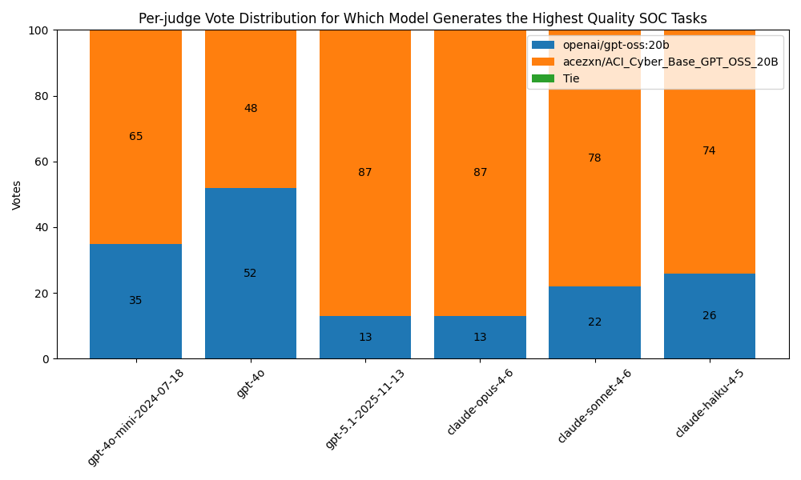
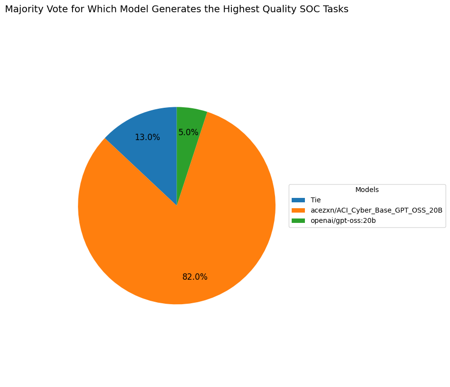

# SOC Investigation Planning Evaluation

ACI_Cyber_Base_GPT_OSS_20B is an LLM derivied from openai/gpt-oss:20b, continued pretrained with security related corpus including computer security QA, CVE descriptions, MITRE ATTCK framework descriptions, Incident Response playbooks, and penetration testing knowledge QA.

The goal of this experiment is to demonstrate the models capabilities on SOC investigation task generation abilities compared to openai/gpt-oss:20b.

# Workflow

## 1. Test Dataset Generation

The experiment uses SOC investigation cases as the test dataset. Each case contains:
- **Title**: Brief summary of the security alert
- **Description**: Detailed information about the security incident

Two models generate investigation task responses for each case:
- **Model A**: `openai/gpt-oss:20b` (baseline model)
- **Model B**: `acezxn/ACI_Cyber_Base_GPT_OSS_20B` (security-specialized model)

**Script**: `test_data_generation.py`
- Use `openai/gpt-oss:20b` to generate 100 SOC investigation cases, with one of the five themes:
    - Network scanning attempt
    - Enumaration attempt
    - Exploitation attempt
    - Unexpected file modifications
    - PrivEsc attempt

**Script**: `generate_responses.py`
- Queries both models with identical prompts
- Each response includes a structured list of investigation tasks
- Output: `output/task_generation_responses.json`

## 2. Multi-Judge Evaluation

While LLM-based test oracle is not completely error free, represntative information can still be gathered by aggregating multiple LLM judges. In this stage, multiple LLM judges are employed to independently evaluate the generated responses using consistent criteria:

**Evaluation Criteria**:
- SOC knowledge depth and accuracy
- Correct terminology usage
- Comprehensive task coverage relative to the security case
- Alert understanding and proper detection rule interpretation

**Judge Models**:
- GPT-4o-mini
- GPT-4o
- GPT-5.1
- Claude Opus 4.6
- Claude Sonnet 4.6
- Claude Haiku 4.5

**Script**: `judge_responses.py`
- Each judge compares responses from Model A and Model B
- Judges select the higher quality response out of the two response
- Output: Separate evaluation files for each judge model

By aggregating judge runs across multiple different LLM models, mistakes caused by biases and non-determinism can be dullified.

# Results

The evaluation demonstrates that ACI_Cyber_Base_GPT_OSS_20B is comparatively more specialized than openai/gpt-oss:20b in SOC investigation planning applications.

